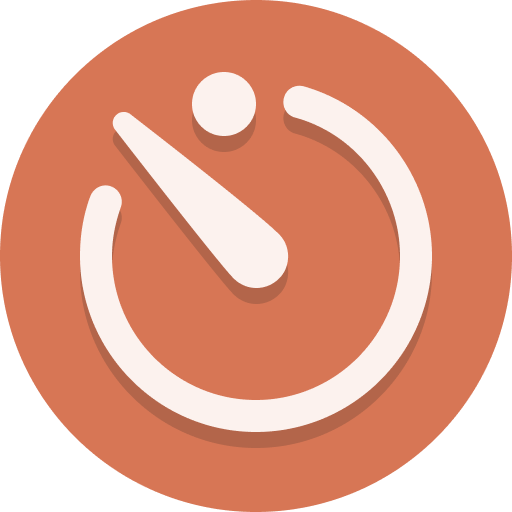

<div align="center">



# Claude Usage Analytics
**Real-time Claude Usage Tracker **

A browser extension for Chrome and Edge that shows your real-time Claude usage limits — current session and Weekly limits, and extra usage credits — directly on the page and in the browser toolbar popup.

[](https://chrome.google.com/webstore)
[](https://microsoftedge.microsoft.com/addons)
[](LICENSE)
[](https://developer.chrome.com/docs/extensions/mv3/)

</div>
---

## Screenshots

  
  
  

---

## 🚀 Key Features
 
- 📊 **Live Usage Bars**: Visual progress bars for your current session and Weekly limits
- 🔄 **Auto-Refresh**: Data refreshes automatically every 60 seconds
- ⏱ **Countdown Timer**: See exactly how many seconds until the next refresh
- 💳 **Extra Usage Support**: Displays extra (paid) usage if enabled on your account
- 🗂 **Popup + Overlay**: Access usage from the toolbar popup or via the floating on-page widget
- 🌙 **Auto Dark/Light Mode**: Adapts to your system theme automatically
- 🔐 **100% Private**: Reads directly from Claude's own API using your existing session — no external servers, no tracking

---


## Installation

### From the Web Store *(recommended)*
- **Chrome:** [Chrome Web Store →](#) *(Link will be added when published)*
- **Edge:** [Microsoft Edge Add-ons →](#) *(Link will be added when published)*


### Manual Installation (Developer Mode)
1. Download or clone this repository
2. Open `chrome://extensions` (or `edge://extensions`)
3. Enable **Developer mode** (top right toggle)
4. Click **Load unpacked**
5. Select this folder  **ClaudeUsageAnalytics**

6. Open [claude.ai](https://claude.ai) — the usage widget will appear in the bottom-right corner
 
---
 
## 🗂 Project Structure
 
```
claude-usage-analytics/
├── manifest.json        # Extension manifest (MV3)
├── content.js           # Injected overlay widget
├── popup.html           # Toolbar popup UI
├── popup.js             # Popup logic
├── utils/
│   └── apiClient.js     # Claude API client (org discovery + usage fetch)
└── icons/
    ├── icon16.png
    ├── icon48.png
    └── icon128.png
```
 
---
 
## 🔐 Permissions
 
| Permission | Reason |
|---|---|
| `scripting` | Inject the usage widget into claude.ai tabs |
| `storage` | Persist user preferences (e.g. theme) across sessions |
| `tabs` | Query open claude.ai tabs from the popup |
| `host_permissions: claude.ai/*` | Access Claude's API using your existing session |
 
No data ever leaves your browser. No external servers are contacted.
 
---
 
## 🤝 Contributing
 
Pull requests are welcome! Ideas for contributions:
 
 
---
 
## 📄 License
 
This project is licensed under the MIT License — see the [LICENSE](https://opensource.org/licenses/MIT) file for details.
 
---
 
## 💡 Tip
 
Click the **Claude Usage** label on the floating widget to collapse it when you don't need it — it stays out of the way until you're ready.
 
